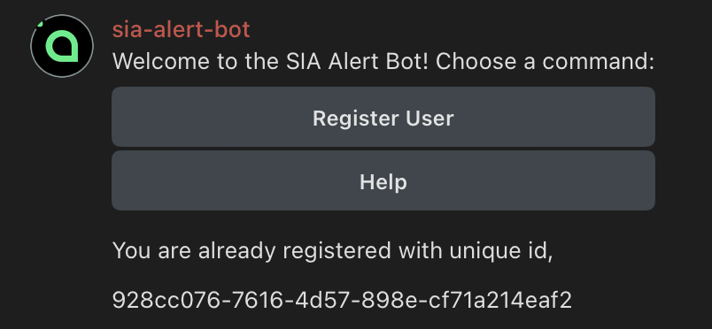

# Sia Hostd/Renterd Telegram Alert APP

Get notified from Telegram when your Sia Hostd/Renterd registers new alerts. The bot is deployed and running on [@sia-alert-bot](https://t.me/@sia_alert_bot).

## Usage

```
git clone https://github.com/justmert/sia-telegram-alert-bot &&
cd sia-telegram-alert-bot &&
bash install.sh
```

> Script will ask you for an unique ID, you can get it from [@sia-alert-bot](https://t.me/@sia_alert_bot)

## Testing

```
bash test.sh
```

## Screenshots

|  |  |
| --- | --- |
|  |  |

# Hosting your own Telegram bot

You can host and run this Telegram bot independently. This presumes a safe reverse proxy configuration as the application is not hardened or secure. 
In summary, this requires the following
1. Setup a Telegram bot registration with [@BotFather](https://t.me/@BotFather) and securely store the TELEGRAM_TOKEN.
2. Setup firebase and obtain a firebase admin service account in JSON format, store this securely as firebase.json and reference in below run command. 
3. Build the volume from github ```docker build -t sia-telegram-alert-bot https://github.com/timrettop/sia-telegram-alert-bot.git#master```
4. Setup docker .env variables similar to the example.env here.
5. Run the container, making sure the "path to firebase.json" is the working path to the file, e.g. /home/docker/sia-firebase-secure-folder ```docker run --it --rm --name sia-telegram-alert-bot -v "{path to firebase.json}:/data:ro" sia-telegram-alert-bot```
7. Replace $service_url in install.sh, then use install.sh and test.sh to setup webhook on [Sia RenterD](https://sia.tech/rent)
8. Bob's your uncle.

