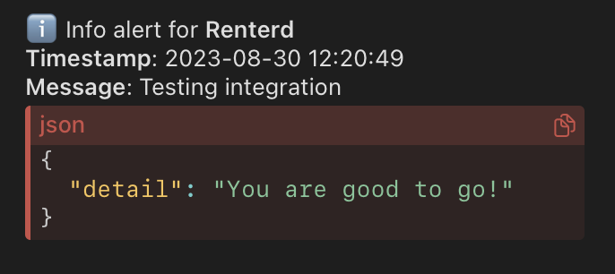
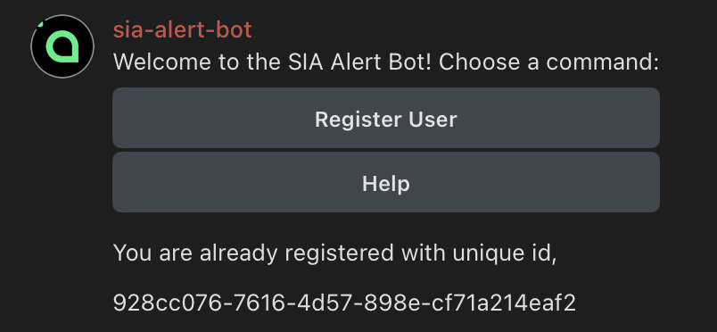

# Sia Hostd/Renterd Telegram Alert APP

Get notified from Telegram when your Sia Hostd/Renterd registers new alerts. The bot is deployed and running on [@sia-alert-bot](https://t.me/@sia_alert_bot).

## Usage

```
git clone https://github.com/justmert/sia-telegram-alert-bot &&
cd sia-telegram-alert-bot &&
bash install.sh
```

> Script will ask you for an unique ID, you can get it from [@sia-alert-bot](https://t.me/@sia_alert_bot)

## Testing

```
bash test.sh
```

## Screenshots

|  |  |
| --- | --- |
|  |  |
